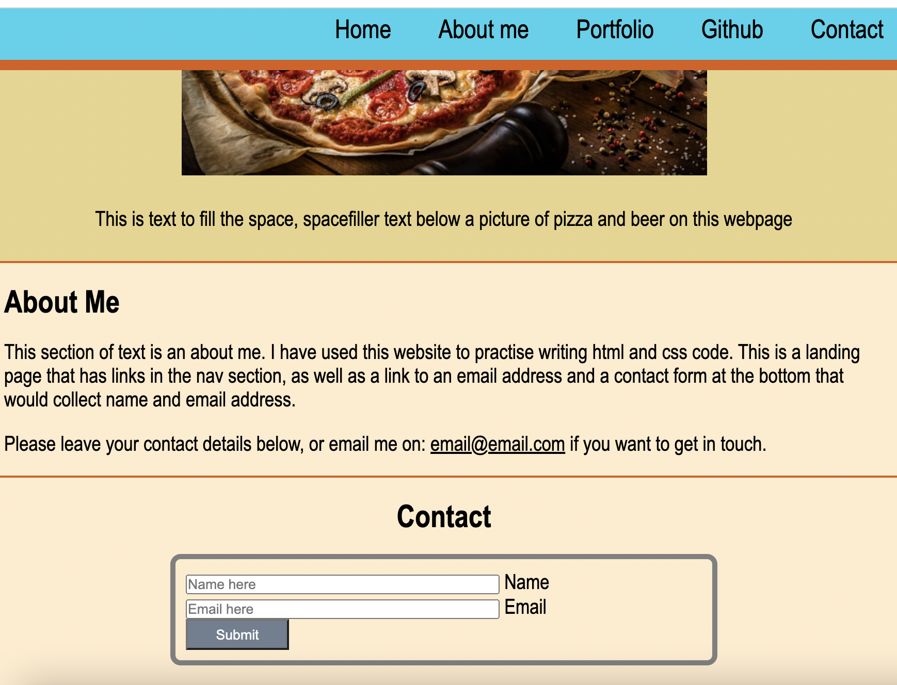

# mini-project-repo

## Description

- This was a practise website created to give me a chance to use skills developed in week 1 of coding bootcamp for html and css.
- Having started to learn to code in that week it was important to try and practise skills covered in the classes.

## Aim

- The aim of the project was to create a landing page that had certain design elements including a fixed heading bar, along with navigation links and a contact form with send button that could be used to capture contact details.

- The below screenshot shows the header being fixed as the page is scrolled down, along with the contact form:

Here is a link to the [deployed website]()